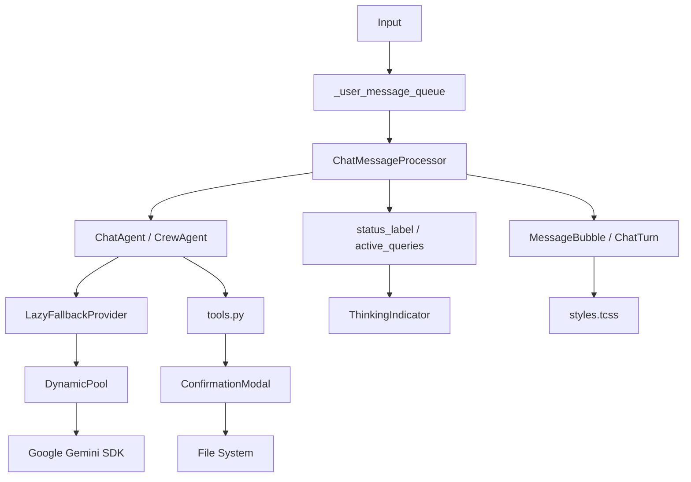

# Master Context: Supporter (EARC - Final Principal Edition)

**Supporter** is a high-performance Python Textual TUI chat client powered by Google Gemini, optimized for rapid interaction, multimodal live sessions, and CrewAI orchestration with dynamic key rotation and secure file-system tooling.

## 1. Project Anatomy & Manifests

- **Entrypoint**: `src.supporter.tui:main` (Command: `supporter`).
- **Dependency Management**: `uv` based (`uv.lock`). Core dependencies: `google-genai` (V1 SDK), `textual`, `crewai`, `pathspec`.
- **Modular Structure**:
  - `src/supporter/tui/`: Encapsulated UI logic, widgets, and reactive state management.
  - `src/supporter/providers/`: Modular LLM provider implementations (Gemini, Gemini Live).
  - `src/supporter/crew/`: CrewAI orchestration, adapters, and agent wrappers.
  - `src/supporter/agent.py`: Core state-machine for session history and tool-calling orchestration.
- **Config & Root Detection**: `config.py` dynamically locates the project root (via `.git` or `pyproject.toml`) to anchor sandboxing and log paths.
- **Styling**: Fully migrated to **Textual-native TCSS** (`styles.tcss`) for high-fidelity widget layouts and reactive property-based styling.

## 2. Infrastructure Internals (`src/supporter/index.py`)

- **Dynamic Pooling**: `DynamicPool` maintains a `deque` of `GeminiProvider` instances. It implements **Round-Robin** rotation across multiple API keys.
  - **Background Resiliency**: Failed provider instances are destroyed and replaced in background tasks to prevent blocking the TUI loop.
  - **Model Cooldowns**: Implements `_model_cooldowns` (30-min window) to automatically bypass models experiencing repeated 5XX errors or transient signals (`unavailable`, `overloaded`).
- **Lazy Fallback Architecture**: `LazyFallbackProvider` uses factory functions for lazy instantiation of primary and fallback pools (e.g., Gemini 1.5 Pro to Flash), triggering only upon rate limits or persistent model errors.
- **Provider Registry**: Thread-safe singleton cache (`_provider_lock`) ensures provider instances are shared across TUI and CrewAI components while maintaining registry integrity for tool-calling.

## 3. Security & Sandboxing (`src/supporter/tools.py`)

- **Git-Aware FS Validation**: `_validate_path` enforces strict security boundaries:
  - **Project Sandboxing**: Operations restricted to `allowed_directories` (project root).
  - **Git-Filtering**: Uses `pathspec` to block access to files ignored by `.gitignore`.
  - **Internal Blacklist**: Explicitly blocks sensitive directories (`.gemini`, `__pycache__`, `.venv`).
- **Write Confirmation Loop**: `write_file` triggers a TUI-level security callback. Changes are staged in a `ConfirmationModal` showing a syntax-highlighted diff; users must explicitly "Allow" before the file system is mutated.

## 4. UI Technicals (`src/supporter/tui/`)

- **Reactive State Engine**: Uses Textual `reactive` descriptors and **Property Linking** to synchronize state across decoupled components:
  - `active_queries`: Global count of pending LLM requests; linked from App to `ThinkingIndicator`.
  - `status_label`: Real-time feedback (Searching, Using Tool, Streaming); linked via `on_mount` watchers.
  - `active_turn`: Reference to the currently focused conversation block.
  - `is_activating_mode`, `crew_mode`, `current_active_agent`: System-level flags for state-aware UI animations.
- **Message Processing Architecture**: Logic is decoupled from the main app into `ChatMessageProcessor`:
  - **Streaming Handler**: Manages real-time token delivery to `MessageBubble` widgets, handling "Thoughts" and "Content" streams separately.
  - **Tool Call Orchestration**: Detects tool usage in streams and updates UI status (e.g., "Searching...") dynamically.
  - **Concurrency Control**: Execution cycles run via `run_worker` to prevent UI blocking during long-running provider requests.
- **Premium Component Suite**:
  - `ChatTurn`: Reactive container managing user/agent bubbles. Features **Auto-Collapse** logic and `manually_expanded` state tracking.
  - `ThinkingIndicator`: Self-contained animated widget that receives state updates via reactive linkers rather than direct app-state access.
  - `QueuedMessagesDisplay`: Visualizes the internal `_user_message_queue` as badges when the agent is busy.
  - `ToastManager`: Ordered notification system for non-intrusive system alerts and task status.

## 5. Interaction & Concurrency

- **Message Serialization**: `SupporterApp` implements a processing lock (`_is_processing`). Subsequent user inputs are queued in `_user_message_queue` and automatically flushed upon cycle completion.
- **Event-Driven Communication**: Mode transitions and agent activations use a `post_message` bus (e.g., `ModeChanged`, `AgentActive`) to ensure decoupled UI updates.
- **History Validation**: `ChatAgent` includes enhanced history sanitization, stripping null candidates and validating candidate integrity to prevent state corruption during multimodal sessions.

## 6. Testing & Mocks

- **Isolation**: `tests/conftest.py` uses `index.clear_providers()` to ensure test-case independence.
- **Async Compliance**: Full `pytest-asyncio` integration for TUI event loops and provider streams.
- **Mocks**: `tests/mocks.py` provides high-fidelity `MockRaw`/`MockCandidate` structures aligned with the latest Google GenAI SDK patterns.

## 7. Project Flow-Graph

